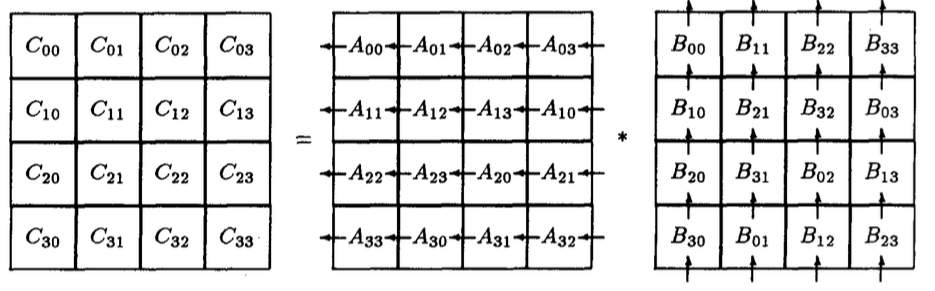
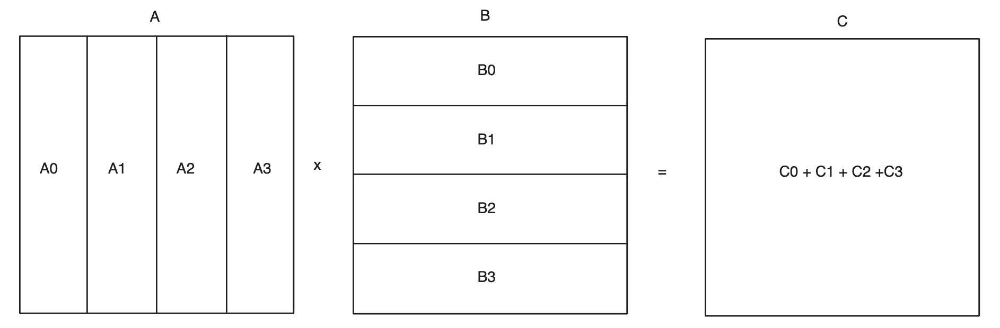

# Introduzione

In questo documento verrà presentato l’algoritmo di Bernsten \[1\] del
1988, che si basa sull’algoritmo di Cannon, con l’idea di migliorarlo
utilizando più delle due dimensioni dell’ipercubo in cui operano i
processori. Inizialmente, verrà fornita una spiegazione teorica dei due
algoritmi, insieme a quello sequenziale, evidenziando un miglioramento
dell'algoritmo di Bernsten rispetto a quello di Cannon. Bernsten,
infatti, riesce ad avere un overhead di comunicazione minore.
Successivamente sarà descritta l'implementazione pratica dell’algoritmo,
per poi calcolare alcune metriche come isoefficienza, speedup, e infine
mostrare i risultati dei banchmark.

# 1 Algoritmi

## 1.1 Algoritmo Sequenziale

In matematica, e più precisamente in algebra lineare, la moltiplicazione
di matrici è il prodotto righe per colonne tra due matrici, possibile
sotto certe condizioni, che dà luogo ad un'altra matrice. Siano date una
matrice A di dimensione $`m\ x\ n`$, ed una seconda matrice B di
dimensioni 𝑛 × 𝑝. Siano 𝑎𝑖𝑗 gli elementi di A e 𝑏𝑖𝑗 gli elementi di B.
Si definisce il prodotto matriciale di 𝐴 per 𝐵, la matrice
𝐶=$`A \times B`$ di dimensioni 𝑚 × 𝑝 i cui elementi 𝑐𝑖𝑗 sono dati da:

``` math
\ \ \ \ \ \ \ \ \ \ \ \ \ \ \ \ \ \ \ \ \ \ \ \ \ \ \ \ \ \ \ \ cij = \ \sum_{r = 1}^{n}{air*brj = ai1*b1j + ai2*b2j + \ldots + ain*bnj}\ \ \ \ \ \ \ \ \ \ \ \ \ \ \ \ \ \ \ \ \ \ \ \ \ \ \ \ \ \ \ \ \ \ \ \ \ \ \ \ \ (1)
```

In pseudocodice, corrisponde a:

> for i = 1 to m:
>
> for j = 1 to p:
>
> for k = 1 to n:
>
> C\[i\]\[j\] += A\[i\]\[k\] \* B\[k\]\[j\]

E’ importante notare che due matrici possono essere moltiplicate fra
loro solo se il numero di colonne della prima è uguale al numero di
righe della seconda, e il prodotto non è commutativo.

La complessità dell’algoritmo è O(m\*n\*p) a causa dei tre cicli
annidati: uno per le righe della prima matrice (m), uno per le colonne
della seconda matrice (p), e uno per sommare tutti I prodotti (n).

L’algoritmo sequenziale di moltiplicazione matriciale nel caso di
matrici quadrate di ordine n ha quindi complessità di $`O(n^{3})`$.

Negli ultimi decenni, ci sono stati significativi miglioramenti negli
algoritmi di moltiplicazione matriciale. I metodi classici, come quello
appena descritto, sono stati affiancati da algoritmi più avanzati. Ad
esempio, l'algoritmo di Strassen, introdotto nel 1969, riduce la
complessità a circa

$`O(n^{2.81})`$ . Tuttavia, in questo documento ci concentreremo
sull'ottimizzazione del prodotto matriciale tramite calcolo parallelo,
con il noto algoritmo di Cannon, e un suo derivato: l’algoritmo di
Bernsten.

## 1.2 Algoritmo di Cannon

Alla base dell’algoritmo di Bernsten \[1\] c’è l’algoritmo di Cannon,
sviluppato nel 1969 dall’omonimo ricercatore. Questo è un algoritmo
parallelo di moltiplicazione matriciale che effettua una decomposizione
di dominio di tipo checkerboard, distribuendo le matrici A, B, C su una
mesh di processori. L’ algoritmo moltiplica generalmente matrici
quadrate di dimensione N, che producono a loro volta una matrice
quadrata della stessa dimensione.

I processori sono organizzati in un ipercubo di dimensione DIM (in
totale $`2^{DIM}`$ CPUs), che sono a loro volta mappati su una griglia
bidimensionale con wrap around di dimensioni $`2^{n1} \times 2^{n2}`$,
dove $`n1 + n2 = DIM`$. Le matrici A, B, C sono divise in sottomatrici
quadrate di dimensione $`\frac{N}{2^{k}} \times \frac{N}{2^{k}}`$ , e
ogni processore avrà assegnate $`2^{k - n1} \times 2^{k - n2}`$
($`k\  \geq \ n1\ ,\ k\  \geq \ n2`$) sottomatrici di A, B, e C.

<figure>

<figcaption><p>Figure 1</p></figcaption>
</figure>

Nella figura 1 è mostrato come A, B, C sono divise in sottomatrici
quadrate, e come i processori (in rosso) le memorizzano.

Prima di iniziare con l’algoritmo vero e proprio, è necessaria una fase
di setup in cui le sottomatrici di A effettuano uno shift verso sinistra
di i posizioni (dove i è la riga del processore che la possiede), mentre
le sottomatrici di B effettuano uno shift verso l’altro di j posizioni
(dove j è la colonna del processore corrispondente alla sottomatrice)
(figura 3).

L'algoritmo procede allora come segue:

For m = 0 to $`2^{k} - 1`$:

> Moltiplica le sottomatrici corrispondenti di cui il processore dispone
> di A e B, aggiungendo il risultato alla corrispondente sottomatrice C
>
> Sostituisci le matrici di A con quelle alla propria destra
>
> Sostituisci le matrici di B con quelle in basso

E’ importante notare che le comunicazioni sono solo tra processori
vicini, e che non c’è overlap tra calcolo e comunicazione.

In $`2^{k}`$ step la matrice C è calcolata, e ogni processore dispone di
sottomatrici corrispondenti di A, B e C.

Ad ogni passo $`2^{k - n1} + 2^{k - n2}`$ sottomatrici sui “bordi” di
ciascun processore vengono communicate ai processi vicini, e ogni
sottomatrice contiene $`{(\frac{N}{2^{k}})}^{2}`$ valori.

Supponendo di lavorare su P processori identici, che il tempo per un
operazione aritmetica sia $`\tau`$, e che il tempo di comunicare
$`\kappa`$ words sia $`\alpha + \beta\kappa`$, allora l’analisi
dell’algoritmo produce il seguente runtime:

``` math
T = \ 2^{k}\ \left\{ \left( 2^{k - n1}*2^{k - n2} \right)\left( \frac{N}{2^{k}} \right)^{3}\tau + 2\alpha + \beta\left( 2^{k - n1} + 2^{k - n2} \right)\left( \frac{N}{2^{k}} \right)^{2} \right\} =
```

> $`= \ \frac{N^{3}}{P}\tau + 2^{k + 1}*\alpha + \ 2^{k}\left( 2^{k - n1} + 2^{k - n2} \right)\left( \frac{N}{2^{k}} \right)^{2}\beta\ \ `$
> *(2)*

Analizzando la formula (2), è possibile trovare i valori ottimali dei
parametri *n1, n2, k*.

La situazione in cui l’algoritmo di Cannon lavora meglio è quella in cui
DIM è pari, e $`k\  = \ n1\  = \ n2\  = \ DIM/2`$. Il tempo di
esecuzione diventa allora il seguente:

``` math
T = \ \sqrt{P}\ \left\{ \left( \frac{N}{\sqrt{P}} \right)^{3}\tau + 2\left( \alpha + \ {\beta\left( \frac{N}{\sqrt{P}} \right)}^{2} \right) \right\} =
```

> $`= \ \frac{N^{3}}{P}\tau + 2\sqrt{P}\alpha + \ \frac{2\ N^{2}}{\sqrt{P}}\ \beta\ `$
> (3)

Se invece DIM fosse dispari, i parametri ottimali sarebbero
$`k\  = \ n1 + 1\  = \ n2\  = \ \frac{DIM\  + 1}{2}`$, ottenendo il
seguente runtime:

$`T = \ \frac{N^{3}}{P}\tau + 2\sqrt{2P}\alpha + \ \frac{3\ N^{2}}{\sqrt{2P}}\ \beta`$
(4)

L’algoritmo di Cannon performa quindi al meglio quando il numero di
processori è un quadrato perfetto, ed essi vengono mappati su una
griglia $`\sqrt{P} \times \sqrt{P},\ `$ciascuno con associata una
sottomatrice quadrata Aln (Bln e Cln) di dimensione
$`\frac{N}{\sqrt{P}}\  \times \ \frac{N}{\sqrt{P}}`$ , che contiene gli
elementi aij (bij e cij) tale che
$`\frac{N\ l}{\sqrt{P}} \leq i \leq \frac{N\ (l + 1)}{\sqrt{P}},\ \frac{N\ n}{\sqrt{P}} \leq j \leq \frac{N\ (n + 1)}{\sqrt{P}},\ \ 0 \geq l,n \geq \sqrt{P}`$.

La situazione diventa allora quella in figura 2.

<figure>

<figcaption><p>Figure 2</p></figcaption>
</figure>

Ragionando in temini di sottomatrici, una sottomatrice Cln è calcolato
come segue:

``` math
Cln = \sum_{m}^{}{Alm*Bmn}
```

Come accennato precedentemente, è necessaria una fase di setup che porti
i processori nella situazione in figura 3.

<figure>

<figcaption><p>Figure 3</p></figcaption>
</figure>

L'algoritmo procede quindi come segue:

From m = 0 to $`\sqrt{P} - 1`$

> Multiply the residing submatrices of A and B and add the product to
> the residing part of C.

Send the submatrix of A to the west.

Receive a new submatrix of A from the east.

Send the submatrix of B to the north.

Receive a new submatrix of B from the south.

Nell’ottica dell’algoritmo di Bernsten, è fondamentale poter applicare
l’algoritmo di Cannon anche su matrici rettangolari. In particolare,
date due matrici A, B tali che A abbia dimensioni NxM e B abbia
dimensioni MxN, la matrice risultato C avrà dimensioni NxN.

I processori posssono si dispongono su una griglia quadrata di
dimensione $`\sqrt{P}`$ come in figura 4, ma le sottomatrici assegnate
ai processori sono ora rettangolari, e hanno dimensioni
$`\frac{N}{\sqrt{P}}\  \times \ \frac{M}{\sqrt{P}}`$ nel caso di A,
mentre quelle di B sono
$`\frac{M}{\sqrt{P}} \times \frac{N}{\sqrt{P}}\ `$.

<figure>

<figcaption><p>Figure 4</p></figcaption>
</figure>

In questo modo, ogni sottomatrice di C può essere calcolata sommando i
prodotti delle sottomatrici rettangolari di A e B righe per colonne, e
la situazione finale sarà la stessa del caso precedente: ogni processore
disporrà di una sottomatrice di dimensione
$`\frac{N}{\sqrt{P}} \times \frac{N}{\sqrt{P}}`$ della matrice C finale.

## 1.3 Algoritmo di Bernsten

L’algoritmo di Bernsten ha come scopo quello di usare più di due delle
dimensioni utilizzate da Cannon disponibili nell’ipercubo quando si
calcola il prodotto $`A \times B`$.

L’idea dell’algoritmo è di dividere la matrice A per colonne, e la
matrice B per righe in $`\sqrt[3]{P}`$ parti . Ogni parte $`A(i)`$ ha
dimensione $`N \times \frac{N}{\sqrt[3]{P}}`$, mentre ogni parte
$`B(i)`$ ha dimensione $`\frac{N}{\sqrt[3]{P}} \times N`$.

<figure>

<figcaption><p>Figure 5</p></figcaption>
</figure>

L’ipercubo di dimensione $`DIM`$ è diviso anche esso in $`\sqrt[3]{P}`$
sottocubi, ciascuno dei quali ha il compito di calcolare il prodotto
$`A(i) \times B(i)`$ con $`P^{2/3}`$ processori disponibili. Infine, la
matrice C è calcolata sommando i vari risultati temporanei $`C(i)`$ di
ogni sottocubo, che avranno tutti dimensione $`N \times N`$

$`C = \ \sum_{i = 0}^{\sqrt[3]{P}}{C(i) = \sum_{i = 0}^{\sqrt[3]{P}}{A(i) \times B(i)\ }\ }`$
(5)

Il prodotto $`A(i) \times B(i)`$ all’interno di ogni sottocubo è
calcolato utilizzando algoritmo di Cannon descritto in nel paragrafo
precedente, in cui però le sottomatrici di A(i) e B(i) associate a ogni
processore saranno rettangolari di dimensione rispettivamente
$`\frac{N}{P^{1/3}}\  \times \frac{N}{P^{2/3}}\ `$ e
$`\ \frac{N}{P^{2/3}}\ \  \times \frac{N}{P^{1/3}}\ `$.

Il tempo di esecuzione dell’algoritmo è composto da $`T1 + T2`$, dove T1
è il tempo impiegato nell’esecuzione dell’algoritmo di Cannon
all’interno dei sottocubi, invece T2 è il tempo impiegato per la
reduction finale che somma i C(i) in modo da restituire la matrice
finale C.

Il tempo T1 deriva dalla formula (3) poichè DIM è pari e ogni sottocubo
avrà dedicato un numero di processori che è un quadrato perfetto
($`P^{\frac{2}{3}})`$. Sostituendo nella formula le dimensioni delle
sottomatrici, si ottiene:

$`\ T1 = \frac{N^{3}}{P}\tau + 2\sqrt[3]{P}\alpha + \frac{{2N}^{2}}{P^{\frac{2}{3}}}\beta\ `$
(6)

Come si può notare, il runtime tramite sottomatrici rettangolari più
piccole (6) è effettivamente minore rispetto a quello in (3). Infine,
però, è necessario effettuare una reduction che sommi le matrici C(i),
per il quale è necessario un tempo T2:

$`T2 = \alpha\ logP^{\frac{1}{3}} + \ \beta\ \frac{N^{2}}{P^{\frac{2}{3}}}`$
(7)

Il tempo impiegato dall’algoritmo di Bernsten nella comunicazione è
leggermente migliorato rispetto a quello di Cannon, ma nella sezione 4
verranno effettuate analisi più approfondite sulla scalabilità e sulle
performance.

# 2 Implementazione

In questa sezione saranno forniti alcuni dettagli implementativi del
software parallelo, in modo da semplificare la comprensione del codice
sorgente.

All’interno del codice, le matrici sono rappresentate tramite una
struttura dati dedicata che memorizza staticamente numero di righe, di
colonne, e tutti i valori in maniera contigua sotto forma di un array
monodimensionale. Allo scopo di ricostruire la struttura bidimensionale
della matrice, è utilizzata una macro che, sulla base della riga e della
colonna, può calcolare la posizione corrispondente dell’elemento
all’interno dell’array.

typedef struct {

int n_rows; // Number of rows of the matrix

int n_cols; // Number of cols of the matrix

dtype entries\[MAX\]; // The actual contiguous matrix

} LOCAL_MATRIX_T;

\#define Entry(A,i,j) (\*(((A)-\>entries) + ((A)-\>n_cols)\*(i) + (j)))

In modo da poter inviare intere matrici con un solo messaggio, è stato
poi creato un tipo di dato MPI apposito.

I *P* processori sono organizzati in un comunicatore cartesiano di
dimensioni $`P^{1/3} \times P^{1/3}\  \times P^{1/3}`$: esso è composto
da $`\sqrt[3]{P}`$ livelli, ciascuno con una griglia bidimensionale di
processori $`\sqrt[3]{P} \times \sqrt[3]{P}`$.

Sono creati poi $`\sqrt[3]{P}\ `$sottocomunicatori bidimensionali con
wrap around, uno per ogni livello; inoltre sono generati $`P^{2/3}`$
sottocomunicatori verticali fissando x, y e facendo variare la
coordinata z. I comunicatori bidimensionali corrispondono ai sottocubi
del paragrafo precedente su cui si applica Cannon per moltiplicare A(i)
x B(i). I comunicatori monodimensionali verticali sono invece utilizzati
per la reduction finale, in modo da ottenere
$`C_{ln\ } = \sum_{i = 0}^{\sqrt[3]{P}}{C^{(i)}}_{\ln}`$

In figura 6 è possibile vedere come sarebbero organizzati P=8 processori
nel comunicatore cartesiano appena descritto. Ci sono
$`\sqrt[3]{P} = 2`$ livelli, ciascuno con una griglia
$`\sqrt[3]{P}\  \times \sqrt[3]{P}`$ ovvero 2x2 di processori. Sono
estratti poi un sottocomunicatore bidimensionale per ogni livelo (rosso
e blu), e un sottocomunicare unidimensionale per ogni linea
tratteggiata. Da notare che la figura mostra solo come sono organizzati
i processori, e non come sono suddivise le sottomatrici che sono in
realtà rettangolari, come mostrato alla fine della sezione 1.2 .

<figure>

<figcaption><p>Figure 6</p></figcaption>
</figure>

Dopo la fase di setup, il processo 0,0,0 legge le matrici A, B dai file
di input e le distribuisce rispettivamente per colonne e per righe ai
processori 0,0, i con $`i = 0,\ \ldots,\sqrt[3]{P} - 1`$. A questo
punto, ogni processo in coordinata 0,0,i (ovvero il “root” del proprio
sottocomunicatore cartesiano 2D di ogni livello) ridistribuisce le
sottomatrici rettangolari di A(i), B(i) in modo da poter poi applicare
Cannon. Infine, come accennato, sui comunicatori verticali è effettuata
la reduction che somma i risultati parziali C(i) in modo che ogni
processore ottenga il proprio $`C_{ln\ }`$definitivo.

Alla fine dell’algoritmo, ogni processore in posizione $`l,n`$ dispone
della matrice $`C_{ln\ }`$ che contiene gli elementi $`cij`$ dove
$`\frac{N\ l}{\sqrt{P}} \leq i \leq \frac{N\ (l + 1)}{\sqrt{P}},\ \frac{N\ n}{\sqrt{P}} \leq j \leq \frac{N\ (n + 1)}{\sqrt{P}},\ \ 0 \geq l,n \geq \sqrt{P}`$

# 3 Scalabilità e Benchmark

Un metodo per misurare la scalabilità di un algoritmo parallelo è quello
di calcolare l’isoefficienza, metrica che dà informazioni su quanto
rapidamente deve crescere la problem size per mantere l’efficienza ad un
valore desiderato. L’isoefficienza si calcola come
$`T1\  \geq CTo`$,dove $`To = pTp - T1`$.

Prima effettuiamo i calcoli relativi all’algoritmo di Cannon. Applicando
la formula soprastante a (3), risulta che
$`To = 2\alpha P\sqrt{P} + 2\beta{\sqrt{P}N}^{2}`$. Calcolando
l’isoefficienza per entrambi i termini in $`\alpha\ `$e $`\beta`$,
risulta che:

- $`N^{3} \geq 2\alpha CP^{3/2}`$

- $`N^{3} \geq 8\beta^{3}C^{3}P^{3/2}`$

In conclusione, l’isoefficienza dell’algoritmo di Cannon è
$`O(P^{3/2})`$.

Allo stesso modo, l’overhead di comunicazione dell’algoritmo di Bernsten
è
$`To = 2\alpha P^{4/3} + \frac{1}{3}\alpha PlogP + 3\beta N^{2}P^{1/3}`$,
da cui:

- $`N^{3} \geq 2\alpha CP^{4/3}`$

- $`N^{3} \geq 27C^{3}\beta^{3}P`$

L’isoefficienza dell’algoritmo di Bernsten è allora $`O(P^{4/3})`$, che
risulta essere leggermente migliore rispetto a quella dell’algoritmo di
Cannon.

Come si può vedere, l’algoritmo di Bernsten propone un miglioramento
rispetto a quello di Cannon, sia riguardo il tempo di esecuzione, sia
riguardo la scalabilità. Procediamo allora con i benchmark del codice
parallelo per analizzare i risultati reali. Il calcolatore utilizzato è
un MacBook Pro M1 con 8 core e 16GB di memoria RAM.

Per misurare le effettive prestazioni degli algoritmi, sono state
effettuate moltiplicazioni di matrici quadrate di diverse dimensioni, a
partire da 64x64 fino a 6000x6000. I tempi sono stati presi molteplici
volte e ne è stata calcolata la media.

Quando si applica l’algoritmo di Bernsten, un vincolo è che il numero di
processori sia $`2^{3i}`$; siccome il calcolatore su cui sono effettuati
I benchmark dispone di soli 8 core, i = 1. L’algoritmo di Bernsten
quindi applicherà Cannon $`\sqrt[3]{P} = 2`$ volte su matrici di
processori 2x2. Il numero di righe e colonne per l’algoritmo di Bernsten
deve essere pari per far si’ che A, B possano essere distribuite tra i
processori; verranno quindi verranno moltiplicate matrici quadrate di
dimensione 64, 128, 256, 512, 1024, 2048, 4096, 6000.

L'algoritmo di Cannon invece, per performare al meglio, ha come vincolo
che il numero di processori sia un quadrato perfetto. In questo caso per
utilizzare tutti i processori a disposizione, l’algoritmo verrà eseguito
con oversubscribe in 9 istanze. I processi si distribuiranno allora su
una matrice 3x3: il numero di righe e colonne deve essere divisibile per
3. Per questo motivo, le dimensioni delle matrici saranno il più simili
possibile a quelle dell’algoritmo di Bernsten, con un arrotondamento per
renderle divisibili per 3.

Segue la tabella con i tempi di esecuzione dell’algoritmo di Bernsten
con 1 processore (T1) , con 8 processori, e l’algoritmo di Cannon in
oversubscribe con 9 processi:

|                     |   *T1 (s)*    | *Bernsten (s)* | *Cannon (s)* |
|---------------------|:-------------:|:--------------:|:------------:|
| $`\sim`$*64x64*     |  *0.0007021*  |  *0.0005593*   | *0.0003671*  |
| $`\sim`$*128x128*   |  *0.0050597*  |  *0.0030849*   | *0.0015756*  |
| $`\sim`$*256x256*   |  *0.0448793*  |  *0.0143516*   | *0.0106323*  |
| $`\sim`$*512x512*   |  *0.3736173*  |  *0.0831811*   | *0.0726821*  |
| $`\sim`$*1024x1024* |  *3.2127390*  |  *0.4915935*   | *0.4806265*  |
| $`\sim`$*2048x2048* |  *28.972495*  |  *4.6897533*   | *4.2588365*  |
| $`\sim`$*4096x4096* | *662.3243617* |  *58.4493392*  | *43.2510045* |
| $`\sim`$*6000x6000* | *1049.603858* | *121.8820393*  | *110.88659*  |

Siano T1 il tempo necessario per eseguire l’algoritmo su un singolo
processore e Tp il tempo necessario per eseguire l’algoritmo su p
processori, seguono allora le metriche:

- Speedup: $`\psi(n,\ p)\  = \ T1/Tp`$

- Efficienza: $`E\  = \ T1/pTp\ `$

|                     | $`\psi`$ *Bernsten* | $`\psi`$ *Cannon* |
|---------------------|:-------------------:|:-----------------:|
| $`\sim`$*64x64*     |       *1.25*        |      *1.91*       |
| $`\sim`$*128x128*   |       *1.64*        |      *3.21*       |
| $`\sim`$*256x256*   |       *3.12*        |      *4.22*       |
| $`\sim`$*512x512*   |       *4.49*        |      *5.14*       |
| $`\sim`$*1024x1024* |       *6.53*        |      *6.68*       |
| $`\sim`$*2048x2048* |       *6.178*       |      *6.80*       |
| $`\sim`$*4096x4096* |       *11.33*       |      *15.31*      |
| $`\sim`$*6000x6000* |       *8.61*        |      *9.46*       |

|                     | *EfficienzaBernsten* | *EfficienzaCannon* |
|---------------------|:--------------------:|:------------------:|
| $`\sim`$*64x64*     |        *0.16*        |       *0.23*       |
| $`\sim`$*128x128*   |        *0.20*        |       *0.40*       |
| $`\sim`$*256x256*   |        *0.39*        |       *0.52*       |
| $`\sim`$*512x512*   |        *0.56*        |       *0.64*       |
| $`\sim`$*1024x1024* |        *0.81*        |       *0.83*       |
| $`\sim`$*2048x2048* |        *0.77*        |       *0.85*       |
| $`\sim`$*4096x4096* |        *1.4*         |       *1.91*       |
| $`\sim`$*6000x6000* |        *1.07*        |       *1.18*       |


# 4 Conclusioni

In conclusione, si può notare il notevole guadagno che si ha
nell’implementare un algoritmo parallelo rispetto a quello sequenziale.
Inaspettatamente però, nonostante l’algoritmo di Bernsten dovrebbe
essere più rapido di quello di Cannon, i risultati non confermano questo
dato: entrambi gli algoritmi paralleli hanno tempi notevolmente migliori
rispetto quello sequenziale, ma l’algoritmo di Cannon sembra essere più
veloce. La causa è probabilmente dovuta al fatto che stiamo lavorando
con un piccolo numero di processori, non permettendo di sfruttare al
meglio l’algoritmo di Bernsten.

Dai benchmark è evidente come con matrici di piccole dimensioni, gli
algoritmi paralleli abbiano ovviamente una bassissima efficienza, che
però aumenta e si stabilizza sopra 0.7 a partire dal prodotto di matrici
1024x1024. I valori di speedup e efficienza sono buoni per entrambi gli
algoritmi, ma è importante notare un comportamento anomalo quando si
moltiplicano matrici molto grandi. A partire dal prodotto di matrici
4096x4096, l’algoritmo sequenziale è estremamente più lento di quello
parallelo, riusltando in uno speedup maggiore di 8, che sarebbe il
limite ideale. Lo speedup infatti si calcola come
$`\frac{T1}{Tp} = \frac{T1*p}{T1 + To}`$, da cui se l’overhead è nullo,
si ottiene lo speedup massimo pari a P. Il motivo di ciò potrebbe essere
ricondubile al fatto che l’algoritmo sequenziale non riesca ad
utilizzare al meglio la cache, a differenza di quelli paralleli che
invece, dividendo le matrici in sotomatrici, riescono a fare.

# Esecuzione dell’algoritmo

E’ possibile provare il funzionamento degli algoritmi con i seguenti
step.

Si lancia il comando make per compilare i codici sorgenti:

\$ make

Si generano casualmente le matrici A e B, possibilmente con una
dimensione divisibile sia per 2 che per 3:

\$ ./gen-int-matrix matrixA 2004 2004

\$ ./gen-int-matrix matrixB 2004 2004

Si lancia l’algoritmo di Bernsten o di Cannon come segue:

\$ mpirun --np 8 ./bernsten matrixA matrixB matrixC_bernsten

\$ mpirun --oversubscribe -np 9 ./cannon matrixA matrixB matrixC_cannon

Si può verificare la correttezza dell’algoritmo tramite la versione
sequenziale classica di moltiplicazione matriciale:

\$ ./seq_mat_mult matrixA matrixB matrixC_seq

Per verificare immediatamente la correttezza dei vari algoritmi, e
confrontare i file di output, si possono controllare i loro digest:

\$ cat matrixC_bernsten \| md5

\$ cat matrixC_cannon \| md5

\$ cat matrixC_seq \| md5

# 

# Bibliography

\[1\] Communication efficient matrix multiplication on hypercubes, Jarle
Bernsten, 1988

\[2\] Scalability of Parallel Algorithms for Matrix Multiplication,
Anshul Gupta and Bipin Kumar, 1991
